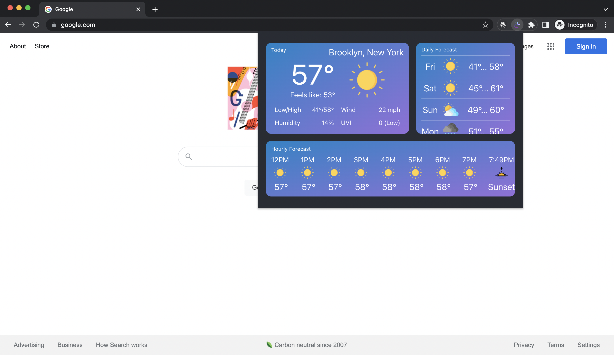

# Luna Weather Assistant

Google chrome extension that allows the user to easily access weather information. It is built in React with custom components created from Emotion styled components. The extension will get the user's geolocation coordinates from the `navigator.geolocation` API. It will then use those coordinates to get weather data from OpenWeather. Once it loads the weather data, it will format it and save to `chrome.storage.local` (or `localStorage` if running as a web application in browser). Upon reloading the application, it will check the local storage if there is weather data from within the last ten minutes and if there is none, then it will make another location and weather data request.

## Built with

- [React](https://reactjs.org/)
- [TypeScript](https://www.typescriptlang.org/)
- [OpenWeather API](https://openweathermap.org/api)
- [Emotion](https://emotion.sh/docs/styled)

## Running locally

Get an api key from [OpenWeather API](https://openweathermap.org/api)

Create an `.env` file in the project directory

Add the following to your `.env` file:

`REACT_APP_API_URL=https://api.openweathermap.org/data/2.5/` \
`REACT_APP_WEATHER_KEY={your_open_weather_api_key}`

If you want to run the application in your browser, you can run `npm start` which will run the app in development mode. You can open [http://localhost:3000](http://localhost:3000) to view it in your browser. The page will reload automatically on any edits to the code and you can see errors in the console.

If you want to run the application as a chrome extension, run `npm run build` which will build the app for production to the `build` folder. You can then visit [chrome://extensions/](chrome://extensions/) in your Chrome browser and toggle on "Developer mode" in the top right corner. Click on the "Load unpacked" button and select the `build` folder. You should then see the application as an extension.

## Screenshots

## Contributors

- [Nick Nguyen](https://github.com/nguyennick197)
